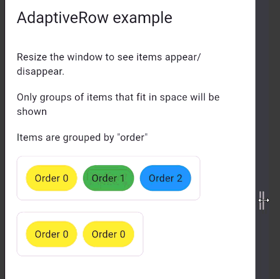

# progressive_ui

A Flutter package for **priority-based responsive layouts**, focused on making adaptive
layouts that react predictably to available space.

Instead of resizing or wrapping widgets, `progressive_ui` **shows and hides groups of
widgets in a defined order**, based on what fully fits.



---

## Table of Contents

- [Motivation](#motivation)
- [Core Idea](#core-idea)
- [Installation](#installation)
- [Usage](#usage)
- [Grouping Behavior](#grouping-behavior)
- [Example](#example)
- [Contributing](#contributing)

---

## Motivation

Flutter provides powerful layout primitives, but handling **progressive disclosure**
of UI elements (toolbars, actions, filters) often leads to:

- complex breakpoint logic
- manual `Visibility` or `if` trees
- layouts that partially render important UI

`progressive_ui` aims to solve this by offering **deterministic, size-aware layouts**
that behave the same way regardless of platform or screen size.

---

## Core Idea

Children are assigned a non-negative **order**.

- Widgets with the same order form a **group**
- Groups are evaluated from lowest to highest order
- A group is rendered **only if all its widgets fit**
- If a group does not fit, it and all higher orders are skipped

This guarantees:

- no partial UI
- no skipped priorities
- no visual instability

---

## Installation

```yaml
dependencies:
  progressive_ui: ^<latest-version>
```

---

## Usage

```dart
AdaptiveRow(
  spacing: 8,
  children: const [
    AdaptiveChild(
      order: 0,
      child: Text('Required'),
    ),
    AdaptiveChild(
      order: 1,
      child: Icon(Icons.download),
    ),
    AdaptiveChild(
      order: 2,
      child: Text('Optional'),
    ),
  ],
)
```

As available space decreases, widgets disappear group by group, never individually.

---

## Grouping Behavior

Multiple widgets may share the same order.

```dart
AdaptiveRow(
  children: const [
    AdaptiveChild(order: 0, child: Text('A')),
    AdaptiveChild(order: 0, child: Text('B')),
    AdaptiveChild(order: 1, child: Icon(Icons.settings)),
    AdaptiveChild(order: 1, child: Icon(Icons.share)),
  ],
)
```

If order 1 does not fit, both icons are hidden together.

This makes the layout ideal for:

- toolbars
- admin interfaces
- dense data UIs
- desktop and web applications

---

## Example

An example application is available in the example/ directory.
It demonstrates:

- resizing behavior
- order-based visibility (0, 1, 2, 3)
- multiple widgets per order group
- strict priority enforcement

---

## Contributing

Contributions are welcome.
If you plan to add new widgets, behaviors, or API changes:

- open an issue first
- include tests
- keep APIs minimal and predictable
